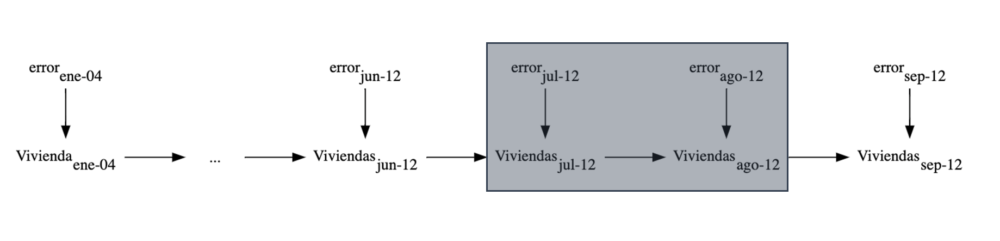

```{r include=FALSE}
library(bsts)
library(ggplot2)
library(zoo)
library(dplyr)
library(tidyr)
library(tsibble)
library(feasts)
library(ggrepel)
set.seed(012)
```

#### Metodos Analíticos 2023

> -   Vianey Galindo Añel
> -   Alberto Fuentes Chavarría

## Predicción inmediata para la venta de casas usando la paquetería BSTS de R y búsquedas de Google.

## Contexto

::: {align="justify"}
La predicción inmediata (nowcasting) es una écnica poderosa que permite estimar y predecir variables económicas y sociales en tiempo real, proporcionando información valiosa para la toma de decisiones rápidas y fundamentadas. Utilizar *nowcasting* permite contar con estimaciones tempranas de variables que generalmente se conocen con cierto desface o retraso considerable.

El *nowcasting* se vale de información de variables relacionadas con la variable objetivo y de las cuales si contamos con información de manera oportuna.

Esta tecnica tiene aplicaciones en diversos ámbitos como:

-   Economía: Calculo PIB, inflación, desempleo.

-   Fianzas: Precios de acciones, bonos, divisas.

-   Salud: Propragación de enfermedades.

-   Medio ambiente: Clima, calidad del aire,

-   Retail: Demanda del consumidor.

<br>

## Objetivo

El objetivo del presentre trabajo es analizar el comportamiento de la serie temporal de datos con cifras de ventas de casas nuevas y ajustar un modelo bayesiano de series de tiempo (BSTS) para hacer predicciones inmediatas y selección de variables explicativas, el cual contemple los siguientes aspectos:

-   Un módulo de series de tiempo, que capture la tendencia general y los patrones estacionales en los datos.

-   Un componente de regresión que permita la incorporación de datos exógenos (e.g. datos de Google Trends).

## Metodología

#### Obtención y pre-procesamiento de datos

Los datos empleados para el análisis se obtuvieron de las estadísticas ,publicadas mensualmente por La Oficina del Censo de EE. UU. (The US Census Bureau) y el Departamento de Vivienda y Desarrollo Urbano de EE. UU. (The US Department of Housing and Urban Development), sobre el mercado de la vivienda al cierre de cada mes. Los datos incluyen cifras sobre 'Casa nueva vendida y por Venta' para el periodo que comprende desde enero del año 2004 hasta septiembre del 2009, se presentan de forma mensual y en unidades de miles.

<br>

## Serie de Tiempo

#### Visualización de viviendas nuevas vendidas

```{r echo = FALSE, warning=FALSE, fig.width=10, fig.height=5, fig.margin = TRUE}
# lectura de datos 
housing <- read.csv("./data/HSN1FNSA.csv", header = T) |> 
  mutate(DATE = as.Date(DATE)) |> 
  mutate(DATE = yearmonth(DATE))|> 
  as_tsibble(index=DATE)
# mean(housing$HSN1FNSA) #57.94286
# sd(housing$HSN1FNSA)   #32.9728 
# xi = zi*sd + mu

ggplot(housing, aes(x=DATE,y=HSN1FNSA, group = 1))+geom_line(size=1)+
  xlab("Fecha")+
  ylab("Viviendas en miles")+
  theme_bw()


```

#### Tendencia

```{r echo = FALSE, warning=FALSE, fig.width=10, fig.height=5, fig.margin = TRUE}
ggplot(housing, aes(x=DATE,y=HSN1FNSA, group = 1))+geom_line(size=1, colour="darkgray")+
  xlab("Fecha")+
  ylab("Viviendas en miles")+
  geom_smooth(se = FALSE, span = 0.5)+
  theme_bw()
```

Gráficando las ventas de casas nuevas, observamos que alcanzaron su punto máximo en marzo de 2005.

-   Su principal característica es la tendencia decreciente.

-   Esta serie también tiene algo de estacionalidad mensual.

#### Estacionalidad (mensual)

```{r echo = FALSE, warning=FALSE, fig.width=10, fig.height=7, fig.margin = TRUE}
  gg_season(housing, HSN1FNSA, labels="both", labels_right_nudge=4, size=1, labels_repel = TRUE) + 
  xlab("Mes")+
  ylab("Viviendas en miles")+
  theme_bw()
```

Podemos observar un patrón fuerte de estacionalidad en los primeros tres años. Con el mes de Marzo con un pico de ventas importante, una disminución el resto del año con un ligero repunte en el mes de Octubre. A partir de Abril 2007 se observa un comportamiento atípico relacionado a la crisis sufrida en el mercado americano. Para los años 2011 y 2012 podemos observar nuevamente una ligera estacionalidad mensual.

#### Autocorrelación

```{r echo = FALSE, warning=FALSE, fig.width=10, fig.height=5, fig.margin = TRUE}
# y <- ts(housing$HSN1FNSA, freq = 12, start = c(2004,1))
#
# afc(y)
# class(y)

feasts::ACF(housing, HSN1FNSA, lag_max = 30) |> autoplot()
```

Esta ACF muestra correlaciones totales, capturando tanto el efecto de la tendencia, como la estacionalidad. Al tener una tendencia tan fuerte como veíamos en las gráficas anteriores, hace sentido que la serie tenga muy alta correlación con los meses inmediatos anteriores, en otras palabras el aspecto de la tendencia esta dominando nuestra gráfica ACF.

Podríamos también preguntarnos por correlaciones parciales, es decir podriamos interesarnos por ver el efecto que tienen la ventas del mes de junio de 2012 en las ventas de septiembre de 2012 cotrolando por las ventas de julio y agosto de 2012.

<center></center>

Es decir, buscamos la correlación directa, bloqueando la correlación que ocurre a través de otros meses intermedios.

```{r echo = FALSE, warning=FALSE, fig.width=10, fig.height=5, fig.margin = TRUE}
feasts::PACF(housing, HSN1FNSA, lag_max = 30) |> autoplot() 
```

Cuando condicionamos meses intermedios en nuestra serie, prácticamente todas las correlaciones parciales se encuentran en los intervalos del 95% (estos intervalos consideran la hipotesis de que los valores de la serie no tienen autocorrelación). Estos datos podrían corresponder a un modelo subyacente autoregresivo de orden 1.

## Modelo bayesiano estructural de series de tiempo (BSTS)

Los modelos bayesianos estructurales de series de tiempo son modelos utilizados para la selección de covariables, forecasting, nowcasting, la inferencia del impacto causal y otras aplicaciones. La representación estado-espacio considerada para el modelo que se busca implementar es:

<center></center>

Donde $\mu_t$ representa la tendencia, $\tau_t$ la estacionalidad y $\beta^Tx_t$ el componente de regresión. El componente de la tendencia es parecida a la ecuación de nivel pero con un término adicional $\delta_t$ que denota la cantidad extra de $\mu$ cuando damos un paso $t \rightarrow t+1$ y puede interpretarse como la pendiente de la tendencia lineal local multiplicada por $\Delta t$ que siempre es igual a 1. En general un modelo con tendencia lineal local es un modelo mejor que el modelo de nivel local si se cree que la serie de tiempo tiene una tendencia en una dirección particular y desea que los pronósticos futuros reflejen un aumento (o disminución) continuo visto en observaciones recientes. Mientras que el modelo de nivel local basa los pronósticos en torno al valor promedio de las observaciones recientes, el modelo de tendencia lineal local también agrega pendientes ascendentes o descendentes recientes. Por este motivo, para este trabajo buscamos comparar estos dos modelos.

La mejor forma de comprender el componente estacional $\tau_t$ es verlo como una regresión con variables estacionales dummies. En nuestro caso tenemos periodos mensuales, de manera que S=12. El modelo de estados estacional incluye las 12 variables dummies pero restringe sus coeficientes para que sumen cero.

#### Construcción de Modelos

Estamos interesados en hacer pronosticos sobre el número de viviendas vendidas en EEUU. Para ello vamos a definir varios modelos, para posteriormente comparar las predicciones a un paso de cada modelo y porder elegir el mejor.

-   **Modelo 1:** Modelo con nivel local y tendencia

-   **Modelo 2:** Modelo con nivel local, tendencia y estacionalidad(12 meses)

-   **Modelo 3:** Modelo con nivel local, tendencia, estacionalidad y componente autoregresiva AR(12)

-   **Modelo 4:** Modelo con nivel local tendencia, estacionalidad y predictores (Google Trends)

Nota: Se decide dejar los últimos 3 meses de nuestra base de datos como "datos nuevos", para realizar nuestro Nowcasting, donde se tienen información sobre las variables regresoras pero aún no se dispone con información para nuestra variable objetivo. Las cifras en esta base obtenida con la herramienta de Google están estandarizadas por lo que se estandarizará la nuestra variable objetivo y se unen las dos bases de acuerdo a la fecha . El resultados es una sola base con 105 renglones (observaciones) y 71 columnas (fecha, ventas de casas y 69 covariables).

#### Modelo 1

El primer modelo es nuestro modelo *base* el cual únicamente contempla la tendencia de los datos.

```{r echo = FALSE, warning=FALSE, fig.width=10, fig.height=5, fig.margin = TRUE}

# Modelo 1
#para los estados con tendencia
data_housing <- read.csv("./data/HSN1FNSA_correlate.csv")

new_data <- tail(data_housing, 3)
data_housing <- tail(data_housing, 102)
ss1 <- AddLocalLinearTrend(list(), data_housing$HSN1FNSA)
model1 <- bsts(data_housing$HSN1FNSA,
               state.specification = ss1,
               niter = 4000,
               ping = 0)

#plot(model1)
plot(model1, "components")

pred1 <- predict(model1, horizon = 3, burn=400)
plot(pred1, plot.original = 102)
```

#### Modelo 2

Para el segundo modelo adicional a la tendencia se agrega la estacionalidad (Mensual).

```{r echo = FALSE, warning=FALSE, fig.width=10, fig.height=5, fig.margin = TRUE}
#Modelo 2
ss2 <- AddSeasonal(ss1, data_housing$HSN1FNSA,nseasons=12)
model2 <- bsts(data_housing$HSN1FNSA,
               state.specification = ss2,
               niter = 4000,
               ping = 0)

#plot(model2)
plot(model2, "components")

pred2 <- predict(model2, horizon = 3, burn=400)
plot(pred2, plot.original = 102)
 
```

Es claro que hay mejoría en la predicción a un paso comparando con el modelo anterior, el intervalo de confianza se hace más pequeño para las predicciones de los últimos 3 meses.

#### Modelo 3

El tercer modelo adicional a los elementos anteriores una componente autorregresiva de nivel 12 AR(12).

```{r echo = FALSE, warning=FALSE, fig.width=10, fig.height=5, fig.margin = TRUE}
#Modelo3
ss3 <- AddAr(ss2, data_housing$HSN1FNSA, lags = 12)
model3 <- bsts(data_housing$HSN1FNSA,
               state.specification = ss3,
               niter = 4000, seed=12,
               ping = 0)

#plot(model3)
plot(model3, "components")

pred3 <- predict(model3, horizon = 3, burn=400)
plot(pred3, plot.original = 102)
```

Y nuevamente obtenemos un modelo con predicciones a un paso más precisas.

Comparamos los tres modelos anteriores con la siguiente gráfica donde vemos los errores acumulados para cada modelo. El tercer modelo es claramente el de mejor desempeño. Cabe resaltar que el modelo que contempla tendencia y estacionalidad tiene peor desempeño al llegar a 80 meses. Esto se puede explicar ya que como veiamos la estacionalidad (mensual) esta marcada pero no en todos los años, mientras que la tendencia decreciente ocurría la mayor parte del tiempo.

```{r echo = FALSE, warning=FALSE, fig.width=10, fig.height=5, fig.margin = TRUE}
#Comparación 3 modelos
CompareBstsModels(list("trend" = model1,
                       "trend + season" = model2,
                       "trend + season + AR12" = model3),
                  colors = c("black", "red", "blue"),burn=400)
```

#### Obtención y pre-procesamiento de datos

Para la construcción de los siguientes dos modelos utilizaremos información obtenida a través de las herramientas de Google( Google Correlate y Google Trends).Se utilizó la serie de tiempo de ventas de casas como input para Google Correlate y el output es otra serie con las 100 búsquedas de Google más correlacionadasy el indice para cada uno de los meses correspondientes. Se depuran variables del output que de acuerdo a criterio experto no haría sentido incluirlas("tahitian noni house", "exhaust sound"...). La base final tendrá sólo 69 columnas adicionales.

<center></center>

```{r}
#data_housing <- read.csv("./data/HSN1FNSA_correlate.csv")
head(data_housing |> select(1:10))
```

#### Modelo 4

**Selección de variables**

Es recomendable hacer seleción de variables si se esta buscando entre una cantidad relativamente grande de regresores, como en nuestro caso. Con el software de BSTS se utiliza una inicial de spike-slab, que asigna a todos los coeficientes una probabilidad de ser 0. Gracias al muestreo de las posteriores se puede contar con una Probabilidad de inclusión en el modelo para cada variable.

```{r echo = FALSE, warning=FALSE, fig.width=10, fig.height=5, fig.margin = TRUE}
#por default busca sólo tomar una variable
model4 <- bsts( HSN1FNSA~ .,
               state.specification = ss2,
               niter = 4000,
               ping = 0,
               data = select(data_housing, -1),
               expected.model.size = 5)

#plot(model4)
plot(model4, "components")
# model3
pred4 <- predict(model4, horizon = 3, newdata = new_data, burn=400)
plot(pred4, plot.original = 102)

```

<br> Nos interesa ver cuales fueron las variables seleccionadas para el modelo 4.

```{r echo = FALSE, warning=FALSE, fig.width=10, fig.height=5, fig.margin = TRUE}
plot(model4, "coefficients", inc=.35, main = "Top de variables seleccionadas para el modelo 4")
```

Las barras están coloreadas según la probabilidad de que el coeficiente sea positivo. Las barras blancas corresponden a coeficientes positivos y las negras a coeficientes negativos.

Para saber si realmente hay una mejora usando los datos de Google comparamos los tres modelos anteriores con el nuevo modelo. Con la gráfica de errores acumulados de predicción a un paso vemos que el modelo que incluye las variables explicativas tiene mejor desempeño a partir del mes 18.

```{r echo = FALSE, warning=FALSE, fig.width=10, fig.height=8, fig.margin = TRUE}
CompareBstsModels(list("Trend" = model1,
                       "Trend + Season" = model2,
                       "Trend + Season + AR(12)" = model3,
                       "Trend + Season + 2Vars" = model4),
                  colors = c("black", "red", "blue","purple"), burn=400)
```

<br> En esta gráfica se puede ver que para Mayo 2007 que es cuando empieza una tendecia a la baja más notable, y que corresponde al periodo 29, la diferencia de los errores acumulados se va haciendo más grande entre los modelos que no incluyen variables contra el que si.

Si quisieramos verificar si los residuos para el último modelo se pueden ver como ruido blanco podemos verlo con la siguiente gráfica ACF.

```{r echo = FALSE, warning=FALSE, fig.width=10, fig.height=5, fig.margin = TRUE}
pred_errors_tbl <- bsts.prediction.errors(model4)$in.sample |> 
  t() |> as_tibble() |>
  mutate(t = 1:102) |> 
  pivot_longer(-c(t), names_to = "sim", values_to = "valor") |>
  group_by(t) |> 
  summarise(valor = mean(valor)) |> 
  as_tsibble(index = t)

ACF(pred_errors_tbl, valor, lag_max = 20) |> 
  autoplot() + ylim(c(-1,1))
```

<br>

## Conclusiones

-   La aplicación de técnicas de nowcasting resultó útil para predecir el número de viviendas vendidas en un corto plazo.
-   La incorporación de información de Google Trends en nuestros modelos demostró mejorar el nivel de precisión en las predicciones.
-   Existen métodos robustos, como el enfoque spike-slab, que permiten seleccionar las variables más relevantes de un conjunto amplio.
-   Aunque disponemos de herramientas poderosas, como Google Correlate y Google Trends, y de metodologías como spike-slab para filtrar variables, aún es necesario utilizar el criterio de un experto para eliminar aquellas variables que no tienen sentido en el contexto (ej. house pricing vs exhaust sound).

## Referencias

-   Banbura, Marta and Giannone, Domenico and Reichlin, Lucrezia, Nowcasting (Noviembre 30, 2010). ECB Working Paper No. 1275, Disponible en SSRN: <https://ssrn.com/abstract=1717887> or <http://dx.doi.org/10.2139/ssrn.1717887>
-   Choi, H. and Varian, H. (2009). Predicting the present with Google Trends. Tech. rep., Google.
-   Choi, H. and Varian, H. (2012). Predicting the present with Google Trends. Economic Record 88, 2--9.
-   U.S. Census Bureau and U.S. Department of Housing and Urban Development, New One Family Houses Sold: United States [HSN1FNSA], retrieved from FRED, Federal Reserve Bank of St. Louis; <https://fred.stlouisfed.org/series/HSN1FNSA>
:::
