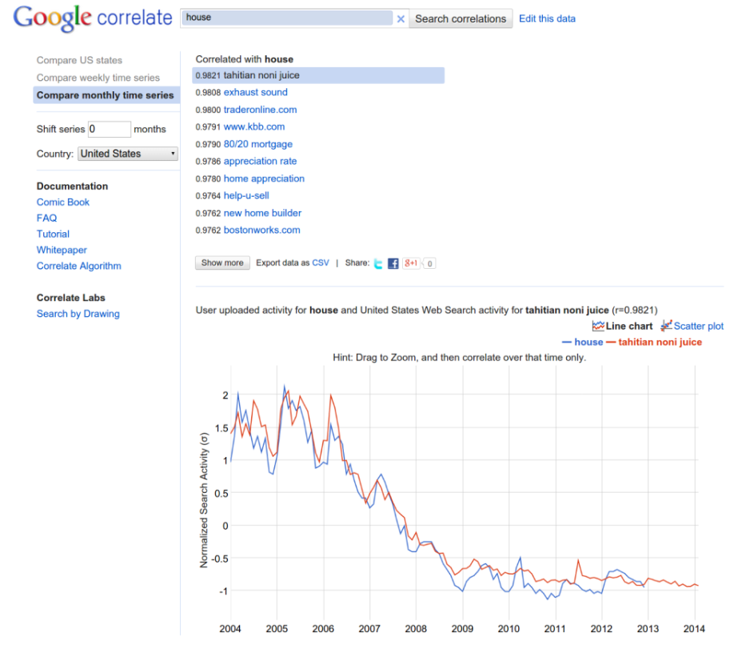
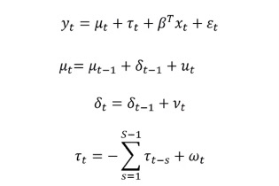

```{r include=FALSE}
library(bsts)
library(ggplot2)
library(zoo)
library(dplyr)
library(tsibble)
library(feasts)
```


#### Metodos Analíticos 2023
> -   Vianey Galindo Añel
> -   Alberto Fuentes Chavarría

## Predicción inmediata para la venta de casas usando la paquetería BSTS de R y búsquedas de Google.

## Contexto
<div align="justify"> La predicción inmediata (nowcasting) es una écnica poderosa que permite
estimar y predecir variables económicas y sociales en tiempo real,
proporcionando información valiosa para la toma de decisiones rápidas y
fundamentadas. Utilizar *nowcasting* permite contar con estimaciones
tempranas de variables que generalmente se conocen con cierto desface o
retraso considerable.

El *nowcasting* se vale de información de variables relacionadas con la
variable objetivo y de las cuales si contamos con información de manera
oportuna.

Esta tecnica tiene aplicaciones en diversos ámbitos como:

-   Economía: Calculo PIB, inflación, desempleo.

-   Fianzas: Precios de acciones, bonos, divisas.

-   Salud: Propragación de enfermedades.

-   Medio ambiente: Clima, calidad del aire,

-   Retail: Demanda del consumidor.

Choi y Varian (2009, 2012) demostraron que los datos de búsqueda de
Google podrían usarse como un señal externa para un modelo de predicción
inmediata, pero sus métodos requerien seleccionar cuidadosamente el
conjunto de predictores a utilizar.

<br>

## Objetivo

El objetivo del presentre trabajo es analizar el comportamiento de la
serie temporal de datos con cifras de ventas de casas nuevas y ajustar
un modelo bayesiano de series de tiempo (BSTS) para hacer predicciones
inmediatas y selección de variables explicativas, el cual contemple los
siguientes aspectos:

-   Un módulo de series de tiempo, que capture la tendencia general y
    los patrones estacionales en los datos.

-   Un componente de regresión que permita la incorporación de datos
    exógenos (e.g. datos de Google Trends).


## Metodología

### Obtención y pre-procesamiento de datos
Los datos empleados para el análisis se obtuvieron de las estadísticas ,publicadas mensualmente por La Oficina del Censo de EE. UU. (The US Census Bureau) y el Departamento de Vivienda y Desarrollo Urbano de EE. UU. (The US Department of Housing and Urban Development), sobre el mercado de la vivienda al cierre de cada mes. Los datos incluyen cifras sobre 'Casa nueva vendida y por Venta’ para el periodo que comprende desde enero del año 2004 hasta septiembre del 2009, se presentan de forma mensual y en unidades de miles. 


Una vez obtenida la base anterior con 105 observaciones se emplearon las herramientas de google para obtener una base con términos de búsqueda de Google Trends (obtenidos de http://trends.google.com/correlate). Estos muestran la popularidad relativa de cada término de búsqueda entre todos los términos de búsqueda ingresados en Google. Lo que se hizo para lograr esto es usar la serie de tiempo de ventas de casas como input para Google Correlate y el output es otra serie con las 100 búsquedas de Google más correlacionadas. Finalmente se eliminan 31 variables del output que no hacen sentido, por ejemplo: "tahitian noni house", “exhaust sound”; por lo que el modelo inicial tendrá sólo 69 regresores. 
<center>


</center>
Las cifras en esta base obtenida con la herramienta de Google están estandarizadas por lo que se estandariza la nuestra variable objetivo y se unen las dos bases de acuerdo a la fecha . El resultados es una sola base con 105 renglones (observaciones) y 71 columnas (fecha, ventas de casas y 69 covariables).


```{r}
data_housing <- read.csv("./data/econ-HSN1FNSA.csv")
head(data_housing)
```


<br>
<br>

#### Visualización de los registros
Las ventas de casas nuevas alcanzaron su punto máximo en marzo de 2005 y
han estado disminuyendo desde entonces.
  
```{r echo = FALSE}
# lectura de datos 
housing <- read.csv("./data/HSN1FNSA.csv", header = T) |> 
  mutate(DATE = as.Date(DATE)) |> 
  mutate(DATE = yearmonth(DATE))|> 
  as_tsibble(index=DATE)
ggplot(housing, aes(x=DATE,y=HSN1FNSA, group = 1))+geom_line()+
  xlab("Fecha")+
  ylab("Casas en miles")


```

Además, podemos intuir que existe una tendencia decreciente y una
estacionalidad mensual, por lo que sería interesante ver las gráficas
ACF y PACF.

```{r echo = FALSE}

# y <- ts(housing$HSN1FNSA, freq = 12, start = c(2004,1))
# 
# afc(y)
# class(y)

feasts::ACF(housing, HSN1FNSA, lag_max = 30) |> autoplot() 
  

```

(INTERPRETACION DE LAS GRÁFICAS)

```{r}
feasts::PACF(housing, HSN1FNSA, lag_max = 30) |> autoplot() 
```


### Modelo bayesiano estructural de series de tiempo

Los modelos bayesianos estructurales de series de tiempo son modelos utilizados para la selección de covariables, forecasting, nowcasting, la inferencia del impacto causal y otras aplicaciones. La representación estado-espacio considerada para el modelo que se busca implementar es: 
<center>

</center>
Donde $\mu_t$ representa la tendencia, $\tau_t$ la estacionalidad y $\beta^Tx_t$ el componente de regresión.
El componente de la tendencia es parecida a la ecuación de nivel pero con un término adicional $\delta_t$ que denota la cantidad extra de $\mu$ cuando damos un paso $t \rightarrow t+1$ y puede interpretarse como la pendiente de la tendencia lineal local multiplicada por $\Delta t$ que siempre es igual a 1. En general un modelo con tendencia lineal local es un modelo mejor que el modelo de nivel local si se cree que la serie de tiempo tiene una tendencia en una dirección particular y desea que los pronósticos futuros reflejen un aumento (o disminución) continuo visto en observaciones recientes. Mientras que el modelo de nivel local basa los pronósticos en torno al valor promedio de las observaciones recientes, el modelo de tendencia lineal local también agrega pendientes ascendentes o descendentes recientes. POr este motivo, para este trabajo buscamos comparar estos dos modelos.

La mejor forma de comprender el componente estacional $\tau_t$ es verlo como una regresión con variables estacionales dummies. En nuestro caso tenemos periodos mensuales, de manera que S=12.  El modelo de estados estacional incluye las 12 variables dummies pero restringe sus coeficientes para que sumen cero. Para el modelo de desempleo, Scott y Varian describieron el ciclo anual con los datos semanales de reclamaciones iniciales utilizando un componente estacional con S=52. Sabemos que las semanas dividen de manera perfecta a los años, pero dado el pequeño número de años para los cuales hay datos de Google disponibles, se consideró que la discontinuidad estacional ocasional de un período es irrelevante.


Para lo antes mencionado, los modelos con enfoque bayesiano que buscamos implementar y comparar ,con la paquetería de BSTS en R, constan de tres técnicas principales:

- Filtro Kalman. La técnica de descomposición de series temporales. En este paso, un investigador puede agregar diferentes variables de estado: tendencia, estacionalidad y otras.

- Método de Spike-and-Slab. En este paso, se seleccionan los predictores de regresión más importantes.

- Media del modelo bayesiano. Combinando los resultados y el cálculo de predicción.

Se realizó un modelo inicial en donde solo se contempla la tendencia y estacionalidad


Se realizó un modelo inicial considerando las 69 covariables obtenidas con google correlate 


#### Selección de Modelo 

Para saber si realmente hay una mejora usando los datos de Google comparamos los dos modelos.

```{r message = FALSE, warning = FALSE}


set.seed(0)
bat <- read.csv("./data/HSN1FNSA.csv", header = TRUE)


```


## Resultados

Falco rufigularis es una especie que se encuentra principalmente en la parte sur del país, mostrando una continua idoneidad en las costas y en la península de Yucatán (el modelo generado tiene un AUC de 0.82 ).


```{r}

```


## Conclusión

El halcón murcielaguero presenta una amplia distribución en México, la cual está altamente correlacionada con la idoneidad ambiental para la especie. Sus poblaciones más abundantes y extensas se encuentran en el sureste del país,
## Referencias

 * Banbura, Marta and Giannone, Domenico and Reichlin, Lucrezia, Nowcasting (Noviembre 30, 2010). ECB Working Paper No. 1275, Disponible en SSRN: https://ssrn.com/abstract=1717887 or http://dx.doi.org/10.2139/ssrn.1717887
 * Choi, H. and Varian, H. (2009). Predicting the present with Google Trends. Tech. rep., Google.
 * Choi, H. and Varian, H. (2012). Predicting the present with Google Trends. Economic Record 88,
2–9.
 * U.S. Census Bureau and U.S. Department of Housing and Urban Development, New One Family Houses Sold: United States [HSN1FNSA], retrieved from FRED, Federal Reserve Bank of St. Louis; https://fred.stlouisfed.org/series/HSN1FNSA


 
</div>


